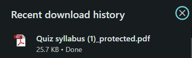

# Word2PDF

## Overview

**Word2PDF** is a complete web application designed to convert Microsoft Word documents (`.doc` and `.docx`) into PDF format. It is built with React.js for the frontend and Node.js with Express for the backend. The app features a responsive design with support for both dark and light themes, and it uses Tailwind CSS for styling. It also integrates various tools and libraries to optimize the development process.

## Technologies Used

- **Frontend**: React.js, Tailwind CSS
- **Backend**: Node.js, Express
- **Styling**: Tailwind CSS
- **Development Tools**: Vite, Nodemon
- **Libraries**:
  - `multer` (for handling file uploads)
  - `docx-pdf` (for converting Word documents to PDF)
  - `hummus-recipe` (for password protection of pdf)
  - `cors`

## Installation

### Frontend

1. **Clone the Repository**:

   ```bash
   git clone https://github.com/your-username/Doc2PDF.git
   cd Doc2PDF

   ```

2. **Install Dependencies**:

   ```bash
   npm install
   ```

3. **Start the Development Server**:

   ```bash
   npm run dev
   ```

   Open your browser and navigate to `http://localhost:3000` to view the application.

### Backend

1. **Install Dependencies**:

   ```bash
   npm install
   ```

2. **Start the Server**:

   ```bash
   nodemon index.js
   ```

   Ensure the backend server is running and accessible.

## Usage

1. **Access the Application**: Go to `http://localhost:3000` in your browser.
2. **Choose a File**: Click the "Choose File" button to upload a .doc or .docx file from your device.
3. **Start Conversion**: Press the "Convert File" button to begin the file conversion process.
4. **Download the PDF**: Once the conversion is finished, you will be provided with a link to download the converted PDF file.
5. **View metadata**: Once file is converted into pdf you will able to see metadata of file at bottom of download button.
6. **Password Protected**: Once file is converted into pdf you will provide a password to open pdf file.
7. **Paasword to open file**: Password for user: secure123 and for owner: owner123 you can change this password inside code for your choice

## Configuration

- **API Endpoint**: The frontend is configured to communicate with the backend API endpoint at `http://localhost:3000/convertFile` (adjust if necessary).

## Screenshots

**Layout**


**Select a File after clicking on Choose A File**


**File Uploaded**


**View metadata and download file after clicking convert file**


**Enter password after clicking on download**


**Password is protected**


**Converted PDF**


**Download from top right corner**


**Pdf Downloaded**



## Contributing

We welcome contributions to improve the project. To contribute:

1. **Fork the Repository**.
2. **Create a New Branch**:
   ```bash
   git checkout -b feature/your-feature
   ```
3. **Make Your Changes**.
4. **Commit Your Changes**:
   ```bash
   git add .
   git commit -m "Add your message here"
   ```
5. **Push to Your Fork**:
   ```bash
   git push origin feature/your-feature
   ```
6. **Create a Pull Request**.
